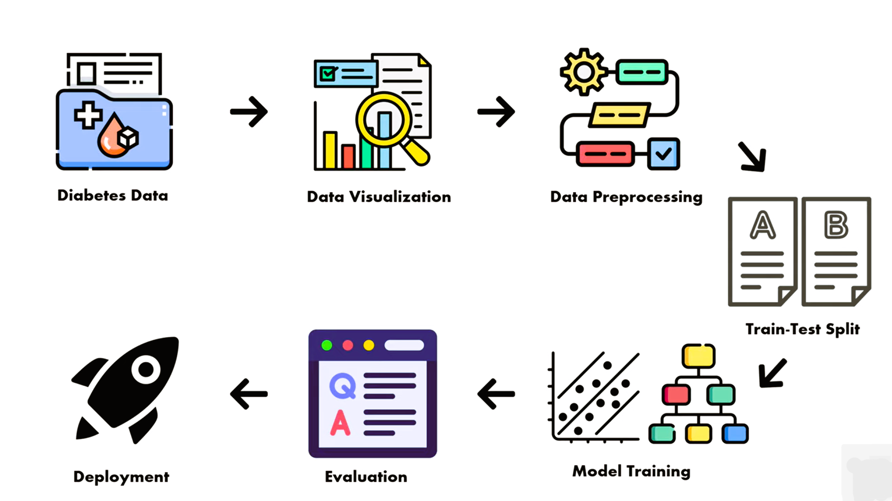
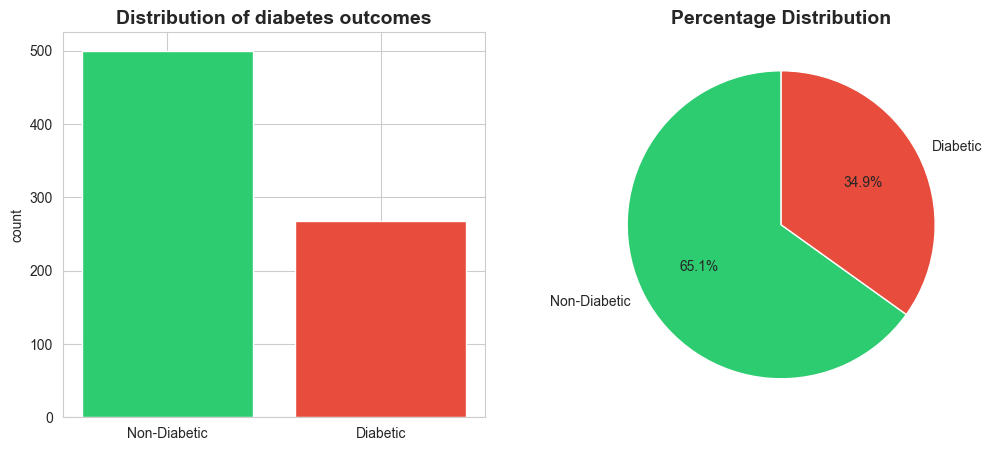
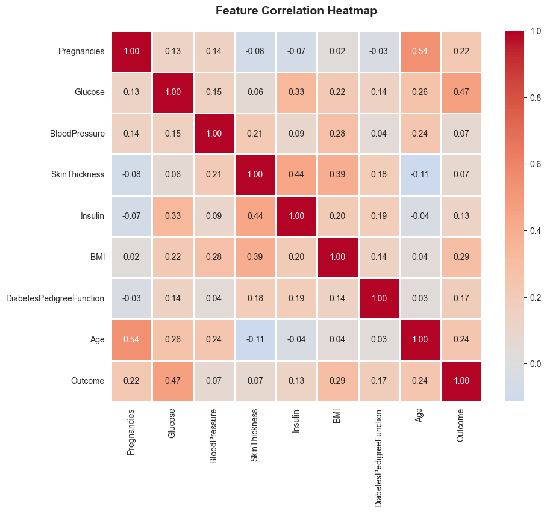
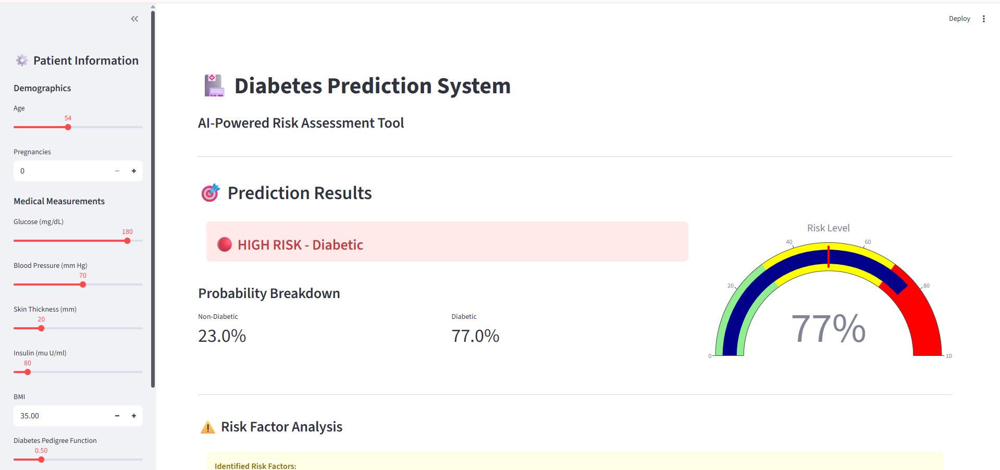
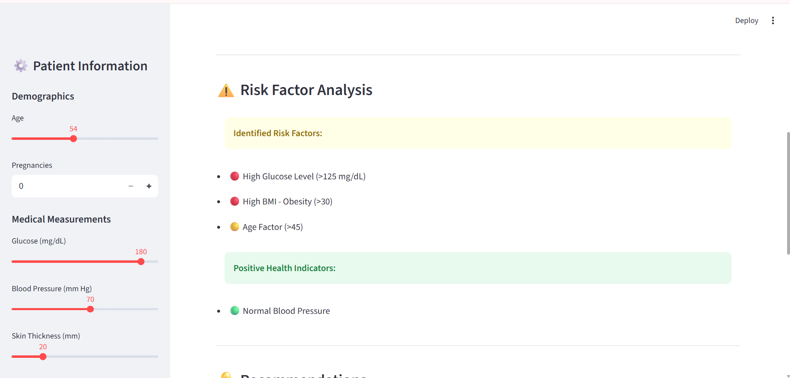
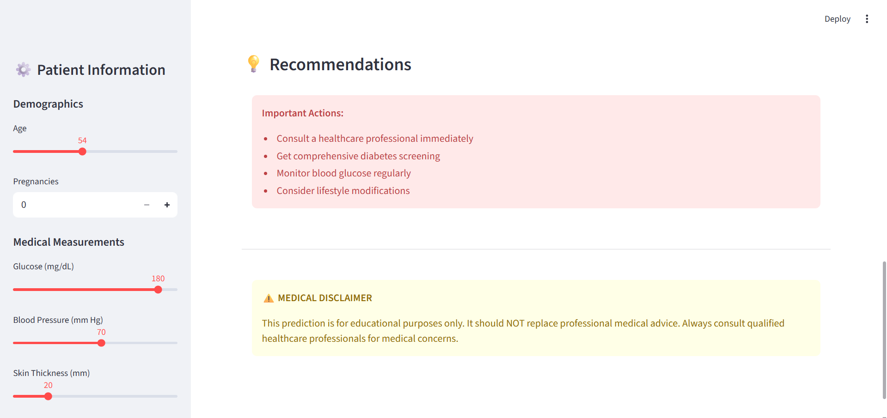

# Diabetes Prediction using Machine Learning

This project predicts the likelihood of diabetes using Machine Learning algorithms trained on the **PIMA Indians Diabetes Dataset**. The system performs preprocessing, training, evaluation, and generates prediction output images.

---

## 📌 Project Overview
The model predicts whether a patient is diabetic based on medical diagnostic features such as glucose level, BMI, insulin level, and age. The trained model achieves reliable performance and generates multiple prediction outputs for analysis.


---

## 🔄 Project Workflow

The following diagram shows the complete pipeline of the diabetes prediction system.




---

## 💻 Technologies Used
- Python 3.10+
- NumPy – Numerical computing
- Pandas – Data manipulation
- Scikit-learn – Machine learning
- Matplotlib & Seaborn – Visualization
- Joblib – Model persistence

---

## 📁 Dataset Features
1. Pregnancies – Number of times pregnant  
2. Glucose – Plasma glucose concentration  
3. BloodPressure – Diastolic blood pressure  
4. SkinThickness – Triceps skin fold thickness  
5. Insulin – 2-Hour serum insulin  
6. BMI – Body mass index  
7. DiabetesPedigreeFunction – Genetic likelihood  
8. Age – Age in years  

Dataset Source:  
https://www.kaggle.com/datasets/uciml/pima-indians-diabetes-database

---

## 📊 Exploratory Data Analysis

### Dataset Visualization


### Outcome Distribution


### Feature Correlation Heatmap


---

## 📊 Model Outputs

### Output 1


### Output 2


### Output 3


---

## 📊 Model Performance
- Accuracy: **77%**
- Precision: **73%**
- Recall: **63%**
- Records used: **768**
- Features analyzed: **8**

---

## 🚀 How to Run

```bash
pip install -r requirements.txt
python app.py
